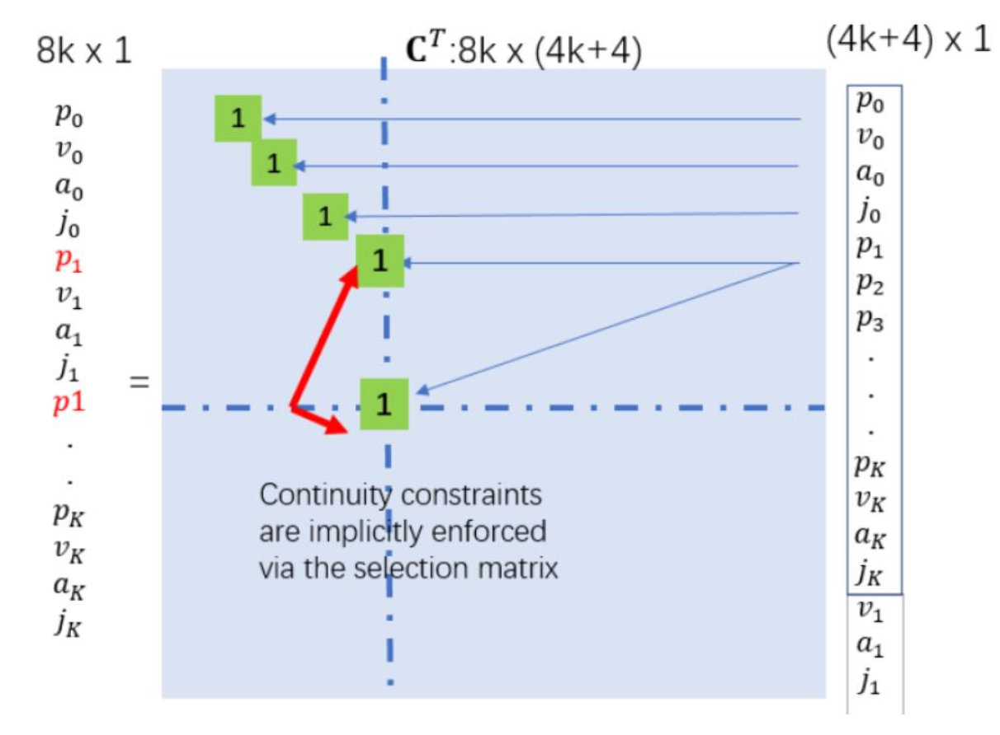

# Minimum Snap Closed Form Solver

## 轨迹描述
由于每一段轨迹都是一个多项式，因此可以将轨迹表示为，
$$
f(t)=\left\{\begin{array}{cc}
f_1(t) \doteq \sum_{i=0}^N p_{1, i} t^i & T_0 \leq t \leq T_1 \\
f_2(t) \doteq \sum_{i=0}^N p_{2, i} t^i & T_1 \leq t \leq T_2 \\
\vdots & \vdots \\
f_M(t) \doteq \sum_{i=0}^N p_{M, i} t^i & T_{M-1} \leq t \leq T_M
\end{array}\right.
$$

其中由于是最小化snap，也就至少需要7次多项式，因此取$N=7$表示每段多项式包括常数项共有8个参数；$p_i$表示该段多项式中的第i个参数，其中$p_0$是常数项，$p_1$是一次项依此类推；$M$表示总共有M段轨迹，并且要求序列$\mathbf{T} = \{T_0,T_1,\cdots,T_M\}$必须都是已知的。

## 封闭形式轨迹求解

假设采用 7 次多项式，一共有 $\mathrm{K}$ 段轨迹。 $p_{i, k}$ 表示第 $\mathrm{k}$ 段多项式的第 $\mathrm{i}$ 个系数，定义多项式向量$\mathrm{P}_{\text {total }}$为，
$$
\mathrm{P}_{\text {total }}=\left(\begin{array}{c}
P_1 \\
P_2 \\
\vdots \\
P_M
\end{array}\right)^T=\left[\begin{array}{c}
p_{0,1} \\
p_{1,1} \\
\cdots \\
p_{7,1} \\
\cdot \\
\cdot \\
\cdot \\
p_{0, K} \\
p_{1, K} \\
\cdots \\
p_{7, K}
\end{array}\right]
$$
定义所有waypoints的状态向量为$\mathrm{d}_{\text {total }}$，其中包含了K+1个点的状态
$$
\mathrm{d}_{\text {total }}=\left[\begin{array}{c}
d_1 \\
d_2 \\
\cdot \\
\cdot \\
\cdot \\
d_K
\end{array}\right]=\left[\begin{array}{c}
p_0 \\
v_0 \\
a_0 \\
j_0 \\
p_1 \\
v_1 \\
a_1 \\
j_1 \\
\cdots \\
p_K \\
v_K \\
a_K \\
j_K
\end{array}\right]
$$
根据$p_j = p_{0, j}+p_{1, j} t_j+p_{2, j} t_j^2+p_{3, j} t_j^3+p_{4, j} t_j^4+p_{5, j} t_j^5+p_{6, j} t_j^6+p_{7, j} t_j^7$，可得
$$
\left\{
\begin{aligned}
&p_{1, j}+2 p_{2, j} t_j+3 p_{3, j} t_j^2+4 p_{4, j} t_j^3+5 p_{5, j} t_j^4+6 p_{6, j} t_j^5+7 p_{7, j} t_j^6=v_j \\
&2 p_{2, j}+6 p_{3, j} t_j+12 p_{4, j} t_j^2+20 p_{5, j} t_j^3+30 p_{6, j} t_j^4+42 p_{7, j} t_j^5=a_j \\
&6 p_{3, j}+24 p_{4, j} t_j+60 p_{5, j} t_j^2+120 p_{6, j} t_j^3+210 p_{7, j} t_j^4=j_j
\end{aligned}
\right.
$$
其中$t_j$表示第j段轨迹的末端时间，${p_{j},v_{j},a_{j},j_{j}}$为第$j$个waypoint所规定的状态，如果取$t=0$，那么就可以得到上一段轨迹的末端时候的状态也就是第$j-1$个waypoint的所规定的状态向量${p_{j-1},v_{j-1},a_{j-1},j_{j-1}}$，因此有，
$$
\begin{aligned}
\mathrm{p}_{0, \mathrm{j}} & =p_{j-1} \\
\mathrm{p}_{1, \mathrm{j}} & =v_{j-1} \\
2 p_{2, j} & =a_{j-1} \\
6 p_{3, j} & =j_{j-1}
\end{aligned}
$$
根据上述的8条等式，再根据所给定的$P_{\text {total }}$向量，可以构建一条等式$\mathbf{M}\mathbf{P} = \mathbf{d}$。但是为了将每一段轨迹都可以构建出来8条等式来满足连续性的约束，这里的$\mathbf{d}$需要重新定义一下，
$$
\mathbf{d} = \left[
\begin{array}{c}
\mathbf{d}_0\\
\mathbf{d}_1\\
\mathbf{d}_1\\
\mathbf{d}_2\\
\vdots\\
\mathbf{d}_{K-2}\\
\mathbf{d}_{K-1}\\
\mathbf{d}_{K-1}\\
\mathbf{d}_{K}\\
\end{array}
\right]_{8K\times 1},\quad \text{其中}\mathbf{d}_i = \left[
\begin{array}{c}
p_i\\
v_i\\a_i\\j_i\\
\end{array}
\right]
$$

所以就可以根据8K条等式构建出矩阵$\mathbf{M}$。

此时可以先定义一个$G(t)$，
$$
G(t) = \left[\begin{array}{cccccccc}
1 & \mathrm{t} & \mathrm{t}^2 & \mathrm{t}^3 & \mathrm{t}^4 & \mathrm{t}^5 & \mathrm{t}^6 & \mathrm{t}^7 \\
0 & 1 & 2 \mathrm{t} & 3 \mathrm{t}^2 & 4 \mathrm{t}^3 & 5 \mathrm{t}^4 & 6 \mathrm{t}^5 & 7 \mathrm{t}^6 \\
0 & 0 & 2 & 6 \mathrm{t} & 12 \mathrm{t}^2 & 20 \mathrm{t}^3 & 30 \mathrm{t}^4 & 42 \mathrm{t}^5 \\
0 & 0 & 0 & 6 & 24 \mathrm{t} & 60 \mathrm{t}^2 & 120 \mathrm{t}^3 & 210 \mathrm{t}^4
\end{array}\right]
$$
且，容易得，
$$
G{(t)}\cdot \mathbf{p} = \left[\begin{array}{cccccccc}
1 & \mathrm{t} & \mathrm{t}^2 & \mathrm{t}^3 & \mathrm{t}^4 & \mathrm{t}^5 & \mathrm{t}^6 & \mathrm{t}^7 \\
0 & 1 & 2 \mathrm{t} & 3 \mathrm{t}^2 & 4 \mathrm{t}^3 & 5 \mathrm{t}^4 & 6 \mathrm{t}^5 & 7 \mathrm{t}^6 \\
0 & 0 & 2 & 6 \mathrm{t} & 12 \mathrm{t}^2 & 20 \mathrm{t}^3 & 30 \mathrm{t}^4 & 42 \mathrm{t}^5 \\
0 & 0 & 0 & 6 & 24 \mathrm{t} & 60 \mathrm{t}^2 & 120 \mathrm{t}^3 & 210 \mathrm{t}^4
\end{array}\right] 
\cdot
\left[\begin{array}{l}
\mathrm{p}_0 \\
\mathrm{p}_1 \\
\mathrm{p}_2 \\
\mathrm{p}_3 \\
\mathrm{p}_4 \\
\mathrm{p}_5 \\
\mathrm{p}_6 \\
\mathrm{p}_7
\end{array}\right] =\left[\begin{array}{c}
f(t) \\
f^{(1)}(t) \\
f^{(2)}(t) \\
f^{(3)}(t)
\end{array}\right]=\left[\begin{array}{l}
\mathrm{p} \\
\mathrm{v} \\
\mathrm{a} \\
\mathrm{j}
\end{array}\right] = \mathbf{d}
$$
再定义一个$L(t)$，
$$
L(t) =\left[ \begin{array}{c}
1 & 0 & 0 & 0 & 0 & 0 & 0 & 0 \\
0 & 1 & 0 & 0 & 0 & 0 & 0 & 0 \\
0 & 0 & 2 & 0 & 0 & 0 & 0 & 0 \\
0 & 0 & 0 & 6 & 0 & 0 & 0 & 0 \\
\end{array}\right]
$$

那么矩阵$\mathbf{M}$就可以这样定义，
$$
\mathbf{M} = \left[ \begin{matrix}L_{1}\left( t\right)_{4\times8}  &\mathbf{0}_{4\times 8} &\cdots &\cdots &\mathbf{0}_{4\times 8} \\ G_{1}\left( t\right)_{4\times8}  &\mathbf{0}_{4\times 8} &\cdots &\cdots &\mathbf{0}_{4\times 8} \\ \mathbf{0}_{4\times 8} &L_{2}\left( t\right)_{4\times8}  &\cdots &\cdots &\mathbf{0}_{4\times 8} \\ \mathbf{0}_{4\times 8}&G_{2}\left( t\right)_{4\times8}  &\ddots &&\vdots 
\\ \vdots &\vdots &&\ddots &\vdots \end{matrix} \right]_{8M\times8M}
$$

然后根据这个图的提示构建$C^T$矩阵，

注意左边的$8k\times1$维的向量等价于上述所说的$\mathbf{d}$向量，右边的$(4k+1)\times 1 $的向量是这样排布的，

定义 $\mathbf{d}_{\mathrm{F}}=\left[\begin{array}{c}p_0 \\ v_0 \\ a_0 \\ j_0 \\ p_1 \\ p_2 \\ \cdots \\ p_{K-1} \\ p_K \\ v_K \\ a_K \\ j_K\end{array}\right], \quad \mathbf{d}_{\mathrm{P}}=\left[\begin{array}{c}v_1 \\ a_1 \\ j_1 \\ \ldots \\ v_{K-1} \\ a_{K-1} \\ j_{K-1}\end{array}\right]$，那么右边的向量就是$\left[\begin{array}{l}\mathbf{d}_F \\ \mathbf{d}_P\end{array}\right]$，

综上所述，可以得到一条等式$\mathbf{d} = C^{T}\left[\begin{array}{l}\mathbf{d}_F \\ \mathbf{d}_P\end{array}\right]$。

再根据之前所说的$\mathbf{M P}=\mathbf{d}$，

就可以得到$\mathbf{P} = \mathbf{M}^{-1}C^T\left[\begin{array}{l}\mathbf{d}_F \\ \mathbf{d}_P\end{array}\right]$，那么就可以求到封闭形式的下的minimum snap的解。
